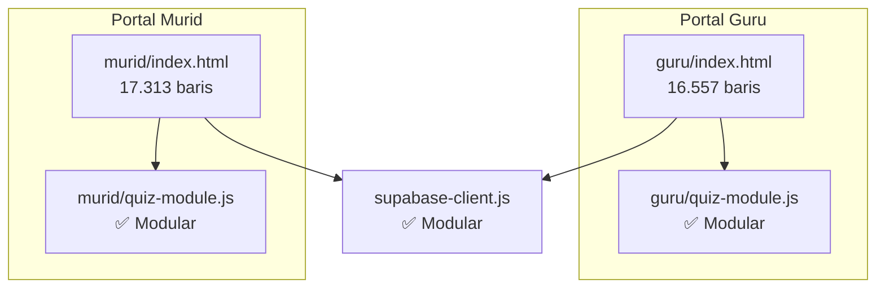
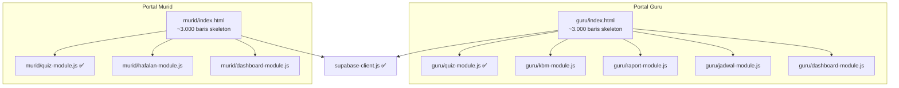

# Rattil Portal Modularization Blueprint v2

> Dokumen ini telah di-audit dan di-cross-reference langsung terhadap kode sumber aktual di repositori.
> Semua nama fungsi, variabel, dan jumlah baris bersumber dari data live hasil pemindaian kode pada 5 Juli 2026.

---

## 1. Kondisi Saat Ini (Fakta Terukur)

| File | Baris Kode | Ukuran | Jumlah Fungsi | Status |
|---|---|---|---|---|
| `guru/index.html` | **16.557** | 857 KB | 400+ fungsi | ⚠️ Monolitik |
| `murid/index.html` | **17.313** | ~900 KB | 300+ fungsi | ⚠️ Monolitik |
| `guru/quiz-module.js` | 2.113 | 120 KB | ~40 fungsi | ✅ Sudah Modular |
| `murid/quiz-module.js` | 1.388 | 70 KB | ~30 fungsi | ✅ Sudah Modular |
| `supabase/supabase-client.js` | 7.598 | ~380 KB | ~100 fungsi | ✅ Sudah Modular |

### Arsitektur Saat Ini (Monolithic)



> [!IMPORTANT]
> Portal Murid (`murid/index.html`) memiliki **17.313 baris** — lebih besar dari Portal Guru (16.557 baris). Rencana modularisasi **wajib** mencakup kedua portal.

---

## 2. Arsitektur Sasaran (Modular SPA)



---

## 3. Inventaris Variabel Global & Dependensi Lintas-Modul

Ini adalah daftar variabel global yang dideklarasikan sebagai `let`/`var` bebas di `guru/index.html` dan dibaca/ditulis oleh banyak fungsi dari domain berbeda:

### 3A. Variabel State Inti (Wajib Tetap di `index.html`)

| Variabel | Letak Deklarasi | Dipakai Oleh | Alasan Tetap di index.html |
|---|---|---|---|
| `token` | Baris 5749 | Login, semua API call | Dikelola oleh Auth flow |
| `currentUser` | Baris 5749 | Dashboard, KBM, Raport | Dikelola oleh Auth flow |
| `halaqahList` | Baris 5750 | KBM, Dashboard, Jadwal | Dimuat saat `startApp()` |
| `muridCache` | Baris 5750 | KBM, Penilaian | Cache lintas-modul |
| `sesiAktif` | Baris 5751 | KBM, Dashboard, Jadwal | State KBM aktif |
| `muridSesi` | Baris 5752 | KBM, Presensi | Murid halaqah sesi aktif |

> [!WARNING]
> **Variabel-variabel di atas TIDAK BOLEH dipindah ke modul manapun.** Mereka harus tetap dideklarasikan di `index.html` dan diakses oleh modul melalui accessor global (contoh: `window.HQ.AppState`).

### 3B. Variabel Domain-Spesifik (Aman Dipindah ke Modul)

| Variabel | Domain | Target Modul |
|---|---|---|
| `_ksBulan`, `_ksTahun`, `_ksBusy` | Kehadiran/Kalender | `jadwal-module.js` |
| `_microteachingKbmCache` | KBM Penilaian | `kbm-module.js` |
| `_kbmDraftTimer`, `_kbmSyncTimer` | KBM Draft Sync | `kbm-module.js` |
| `_riwayatData`, `_riwayatDataFiltered` | Riwayat KBM | `kbm-module.js` |
| `_prData`, `_prDataFiltered` | Peninjauan PR | `kbm-module.js` |
| `jadwalData` | Jadwal | `jadwal-module.js` |
| `editPresensiKBMId`, `editPresensiHalaqah` | Presensi | `kbm-module.js` |
| `KRITERIA_MT`, `OPT_MT` | Micro-Teaching | `kbm-module.js` |

---

## 4. Fungsi Utilitas Bersama (Shared Utilities)

Fungsi-fungsi berikut dipakai oleh banyak domain dan **wajib tetap tinggal di `index.html`** sebagai *core utilities*:

| Fungsi | Baris | Dipakai Oleh | Catatan |
|---|---|---|---|
| `toast()` | 10449 | KBM, Dashboard, Raport, dsb. | Quiz-module pakai `alert()` sendiri (inkonsisten, idealnya dimigrasi ke `toast` nanti) |
| `esc()` | 10550 | Semua rendering HTML | HTML escape utility |
| `fmtDate()` | 10533 | Semua tampilan tanggal | Format tanggal Indonesia |
| `showErr()` | 5984 | Auth & error handling | Error display |
| `goPage()` | 6247 | Navigasi SPA | Router utama |
| `openSB()` / `closeSB()` | 6319-6320 | Sidebar | UI Shell |
| `validateFields()` | 6806 | KBM, Formulir | Form validation |
| `_localDateStr()` | 5814 | KBM, Dashboard | Tanggal WIB |
| `hqCard()` | 6786 | Dashboard | Halaqah card renderer |
| `startApp()` | 5994 | Init | Bootstrap utama |

> [!NOTE]
> Fungsi-fungsi ini **tidak perlu** dipindah ke file terpisah. Mereka tetap di `index.html` dan otomatis tersedia karena dideklarasikan sebelum modul-modul dimuat.

---

## 5. Rincian Pemecahan Modul & Tanggung Jawab

### A. Portal Guru — Modul Jadwal & Kehadiran (`guru/jadwal-module.js`)
**Prioritas: 1 (PERTAMA)** — Paling sedikit ketergantungan ke state global.

* **Fungsi yang Dimigrasikan**:
  * `loadLiveJadwal()`, `renderJdPekanan()`, `renderJdBulanan()`, `renderJdKalAgenda()`
  * `updateJdKalStats()`, `switchJdTab()`, `initJadwalPage()`, `initJdBulanan()`
  * `jdKalNav()`, `pilihJdTanggal()`
  * `loadKehadiranSaya()`, `ksNavBulan()`, `ksToggleDetail()`, `ksBukaSusulan()`, `ksTandaiIzin()`
  * `_ksWeekday()`, `_ksTodayJakarta()`, `_ksDayColor()`, `_ksSisaPengganti()`
* **Variabel yang ikut pindah**: `_ksBulan`, `_ksTahun`, `_ksBusy`, `_ksDetailOpen`, dan semua konstanta `_KS_*`.
* **Ketergantungan state global**: Hanya membaca `sesiAktif` (read-only) dan `halaqahList`.
* **Risiko**: ⬇️ Rendah.

### B. Portal Guru — Modul Dashboard (`guru/dashboard-module.js`)
**Prioritas: 2** — Cukup mandiri, hanya membaca data.

* **Fungsi yang Dimigrasikan**:
  * `loadDashboard()`, `hqCard()`
  * Grafik keaktifan dan banner pengumuman di dashboard.
* **Ketergantungan state global**: Membaca `currentUser`, `halaqahList`, `sesiAktif`.
* **Risiko**: ⬇️ Rendah.

### C. Portal Guru — Modul Raport & Evaluasi (`guru/raport-module.js`)
**Prioritas: 3** — Jarang diubah, tapi cukup kompleks.

* **Fungsi yang Dimigrasikan**:
  * Logika halaman `page-nilai-manual`, `page-raport`, `page-raport-tahfidz`.
  * Perhitungan rata-rata nilai, bobot, status kelulusan.
  * PDF Raport Generator.
* **Variabel yang ikut pindah**: Semua variabel `_raport*` dan `_nilai*`.
* **Risiko**: ⬇️ Sedang.

### D. Portal Guru — Modul KBM & Presensi (`guru/kbm-module.js`)
**Prioritas: 4 (TERAKHIR)** — Paling banyak ketergantungan state global.

* **Fungsi yang Dimigrasikan**:
  * `doBukaKBM()`, `lanjutSesi()`, `tutupSesiKBM()`, `cekSesiDraft()`
  * `renderPresensi()`, `togPresensi()`, `doSimpanPresensi()`
  * `_saveKbmDraftLocal()`, `_kbmServerSyncFlush()`, `_hydrateKbmCacheFromDraft()`
  * Logika sinkronisasi offline (Fase 2).
* **Variabel yang ikut pindah**: `_kbmDraftTimer`, `_kbmSyncTimer`, `_microteachingKbmCache`, `KRITERIA_MT`, `OPT_MT`, dan semua variabel `_pr*`.
* **Ketergantungan state global**: Membaca **dan menulis** `sesiAktif`, `muridSesi`, `halaqahList`, `muridCache`.
* **Risiko**: ⬆️ **Tinggi** — harus dimigrasikan paling akhir setelah pola dari modul lain terbukti stabil.

> [!CAUTION]
> **KBM adalah fitur paling kritis.** Fungsi autosave draft (`_saveKbmDraftLocal`) dipanggil oleh event `pagehide` dan `visibilitychange` yang terdaftar di `index.html`. Jika fungsi ini dipindah ke modul tanpa diekspos ke `window`, **data penilaian guru akan hilang** saat browser ditutup mendadak.

### E. Portal Murid — Modul Hafalan & Riwayat (`murid/hafalan-module.js`)
**Prioritas: 5** — Dikerjakan setelah guru selesai.

* **Fungsi yang Dimigrasikan**:
  * `loadRiwayat()`, `renderRiwayat()`, `toggleRiwayat()`, `muatLebihRiwayatMurid()`
  * `renderKalender()`, `kalNav()`
  * Logika At-Tibyan murid dan partner belajar.

### F. Portal Murid — Modul Dashboard (`murid/dashboard-module.js`)
**Prioritas: 6**

* **Fungsi yang Dimigrasikan**:
  * `loadDashboard()` (murid), `renderDashKalender()`, `renderDashKalAgenda()`
  * `openProgressBreakdown()`, `openMicroTeachingBreakdown()`
  * Sistem notifikasi (`openNotifications()`, `loadKeaktifanAlertsMurid()`, dll.)

---

## 6. Rencana Tahapan Migrasi (Safe Phased Migration)

```
[Fase 1: Persiapan]  ──>  [Fase 2: Extract & Bind]  ──>  [Fase 3: Verify]  ──>  [Fase 4: Clean]
Buat AppState namespace    Pindahkan fungsi ke           Uji coba seluruh       Hapus kode lama
di index.html              file JS baru + expose         fitur terkait          di index.html
                           ke window
```

### Langkah Detail Per Modul:

1. **Fase 0 — Persiapan Namespace (Sekali Saja)**:
   Tambahkan objek `window.HQ.AppState` di `index.html` yang membungkus semua variabel state bersama:
   ```javascript
   window.HQ.AppState = {
       get token() { return token; },
       set token(v) { token = v; },
       get currentUser() { return currentUser; },
       get sesiAktif() { return sesiAktif; },
       set sesiAktif(v) { sesiAktif = v; },
       // ... dst
   };
   ```

2. **Fase 1 — Migrasi `jadwal-module.js`** (risiko terendah):
   * Buat file `guru/jadwal-module.js`.
   * Pindahkan semua fungsi jadwal & kehadiran.
   * Bungkus dalam IIFE: `(function() { ... })();`
   * Expose fungsi publik ke `window`: `window.initJadwalPage = ...`
   * Tambahkan tag `<script src="jadwal-module.js?v=1.0" defer>` di `index.html`.
   * **Uji**: Buka tab Jadwal & Kehadiran, pastikan kalender dan agenda berfungsi.
   * **Rollback**: Jika gagal, hapus tag script dan uncomment kode lama.

3. **Fase 2 — Migrasi `dashboard-module.js`** (setelah Fase 1 stabil 3 hari).

4. **Fase 3 — Migrasi `raport-module.js`** (setelah Fase 2 stabil 3 hari).

5. **Fase 4 — Migrasi `kbm-module.js`** (setelah semua modul lain stabil 1 minggu).

---

## 7. Strategi Rollback (Pembatalan Darurat)

> [!IMPORTANT]
> **Kode lama di `index.html` TIDAK LANGSUNG DIHAPUS.** Kode tersebut di-comment-out (`/* ... */`) dan baru dihapus permanen setelah modul baru terbukti stabil selama **minimal 7 hari** di produksi tanpa laporan bug.

Jika terjadi bug kritis pasca-migrasi:
1. Hapus tag `<script src="xxx-module.js">` dari `index.html`.
2. Uncomment kode lama yang masih tersimpan.
3. Commit & push. Waktu pemulihan: **< 5 menit**.

---

## 8. Analisis Risiko & Mitigasi

> [!WARNING]
> **Kebocoran Memori (Memory Leak) dari Event Listener Ganda**
> * **Risiko**: Jika event global (`window.addEventListener`) ditulis di dalam fungsi rendering modul, listener akan terduplikasi setiap kali tab dibuka.
> * **Mitigasi**: Event listener global hanya dipasang **sekali** di `index.html` saat `DOMContentLoaded`.

> [!CAUTION]
> **Kebocoran Data (Data Loss) pada Draft Offline KBM**
> * **Risiko**: Event `pagehide` memanggil `_saveKbmDraftLocal()`. Jika fungsi ini tidak terekspos ke `window`, data nilai guru hilang secara senyap.
> * **Mitigasi**: Wajib ekspos ke `window.HQ_KBM = { saveDraftLocal: _saveKbmDraftLocal }` dan pastikan event handler di `index.html` memanggil `window.HQ_KBM.saveDraftLocal()`.

> [!WARNING]
> **Desinkronisasi State Global (Scope Shadowing)**
> * **Risiko**: Modul baru mendeklarasikan `let sesiAktif` lokal → data tidak sinkron dengan `index.html`.
> * **Mitigasi**: Semua modul mengakses state bersama **hanya** melalui `window.HQ.AppState`.

> [!NOTE]
> **Balapan Pemuatan File (Race Conditions)**
> * **Risiko**: Modul dimuat sebelum `supabase-client.js` siap.
> * **Mitigasi**: Urutan tag script di HTML: `supabase-client.js` → modul-modul → init. Semua modul dibungkus IIFE dan tidak mengeksekusi kode database di top-level.

---

## 9. Perbandingan Arsitektur: Monolitik vs Modular

| Parameter | Monolitik (Sekarang) | Modular (Sasaran) |
|---|---|---|
| **Isolasi Error** | ❌ Satu error mematikan seluruh portal | ✅ Error terisolasi per modul |
| **Ukuran Download** | ❌ 850+ KB setiap perubahan kecil | ✅ Hanya modul yang berubah yang diunduh ulang |
| **Kemudahan Debug** | ❌ Error di "index.html baris 12.345" | ✅ Error di "kbm-module.js baris 45" |
| **Kerja Tim** | ❌ Merge conflict tinggi | ✅ File terpisah, aman paralel |
| **Akses State** | ✅ Langsung bebas | ⚠️ Perlu namespace (`HQ.AppState`) |
| **Urutan Muat** | ✅ Terjamin linier | ⚠️ Perlu `defer` dan urutan tag |
| **Rollback** | ✅ Tidak perlu | ✅ Comment/uncomment kode lama |

---

## 10. Checklist Validasi Pasca-Migrasi (Per Modul)

Setiap modul yang selesai dimigrasikan **wajib** melewati checklist ini sebelum dianggap stabil:

- [ ] `node -c guru/xxx-module.js` — Lolos syntax check
- [ ] Semua fungsi publik bisa dipanggil dari konsol browser
- [ ] Tab/halaman terkait berfungsi normal di desktop (Chrome)
- [ ] Tab/halaman terkait berfungsi normal di mobile (Safari iOS & Chrome Android)
- [ ] Tidak ada error `undefined` di console browser
- [ ] Variabel state global (`sesiAktif`, `token`, dll.) masih sinkron
- [ ] Event listener `pagehide`/`visibilitychange` masih berfungsi (khusus KBM)
- [ ] Git push berhasil & deploy otomatis berjalan
- [ ] Stabil selama 7 hari tanpa laporan bug sebelum menghapus kode lama
