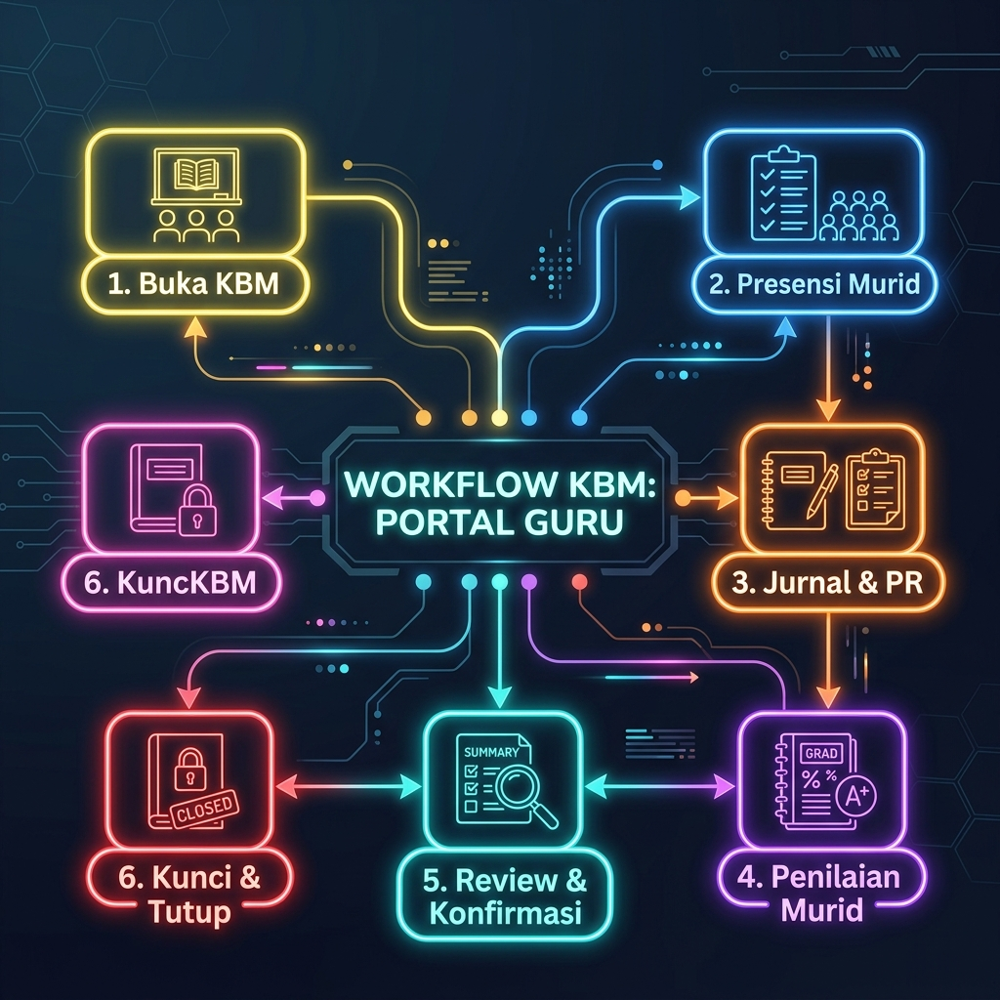
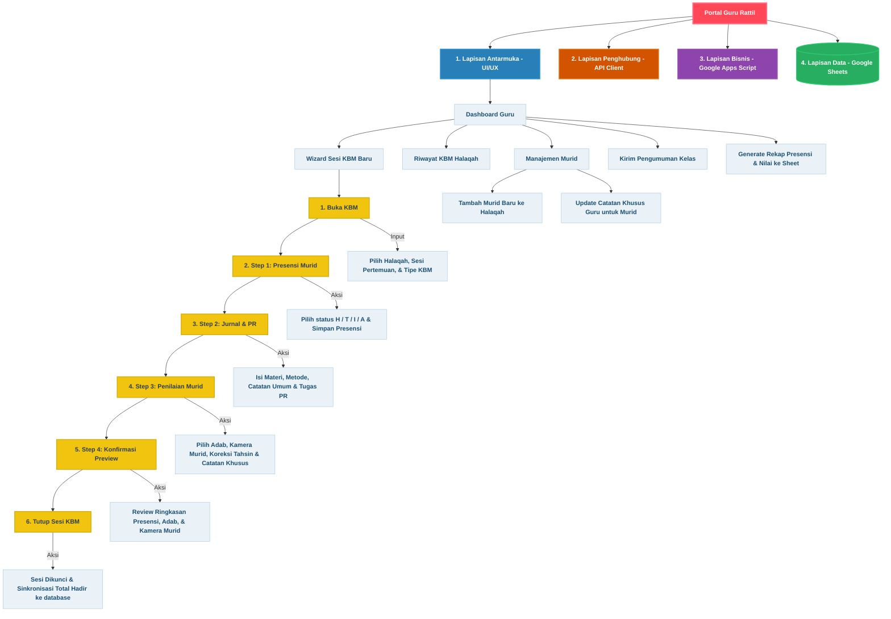

# Dokumentasi Teknis Detail: Portal Guru Rattililqur'an

Dokumen ini ditujukan untuk memberikan pemahaman menyeluruh dan mendalam mengenai arsitektur backend, skema database, siklus hidup (lifecycle) sesi KBM, dan alur transaksi data di Portal Guru.

---

## 1. Mind Mapping & Alur Kerja Sesi KBM
Diagram alur detail pengolahan data KBM dari inisiasi hingga finalisasi (penguncian data):





---

## 2. Skema & Struktur Database (Google Sheets)

Database diorganisasikan dalam beberapa tabel utama pada Google Sheets yang saling berelasi via ID kunci (`id_user`, `id_halaqah`, `id_kbm`):

### A. Tabel Log KBM Global (`KBM_LOG`)
Menyimpan ringkasan per sesi pertemuan kelas halaqah yang dibuat.
* `id_kbm` (String - PK): ID unik sesi KBM (contoh: `KBM-20260529-1234`).
* `id_halaqah` (String - FK): ID halaqah terkait.
* `id_guru` (String - FK): ID guru pengajar.
* `nama_guru` (String): Nama lengkap guru.
* `tanggal_pertemuan` (Date): Tanggal pelaksanaan KBM.
* `jam_mulai` (String): Waktu mulai kelas (Format: `HH:mm`).
* `jam_selesai` (String): Waktu selesai kelas (diisi otomatis saat sesi ditutup).
* `pertemuan_ke` (Integer): Urutan pertemuan kelas (misal: `1`, `2`, `3`).
* `jenis_sesi` (String): Tipe pembelajaran (`KBM Reguler` / `Ujian Akhir`).
* `pencapaian_modul` (String): Jurnal materi tahsin yang dipelajari.
* `metode` (String): Metode tahsin (`Talaqqi`, `Murajaah`, dll).
* `catatan_umum` (String): Evaluasi umum suasana KBM.
* `latihan_mandiri` (String): Tugas PR untuk murid.
* `jenis_latihan` (String): Jenis PR (VN, Membaca Mandiri, dll).
* `deadline_latihan` (Date): Tenggat pengumpulan tugas PR.
* `jumlah_hadir` / `jumlah_alpa` (Integer): Rekapitulasi jumlah murid hadir/alpa.
* `status` (String): Status sesi (`draft` = KBM sedang berjalan, `tutup` = KBM selesai & dikunci).
* `timestamp_dibuat` (DateTime): Waktu perekaman awal log sesi.

### B. Tabel Detail Pertemuan per Kelas (`KBM_[nama_halaqah]`)
Setiap halaqah memiliki satu sheet dinamis terpisah yang mencatat data per sesi murid secara mendetail.
* `id_nilai` (String - PK): ID nilai KBM murid per sesi (contoh: `NLI-20260529-5678`).
* `id_kbm` (String - FK): ID relasi sesi KBM.
* `id_halaqah` (String - FK): ID relasi halaqah.
* `pertemuan_ke` (Integer): Urutan pertemuan.
* `tanggal` (Date): Tanggal belajar.
* `jam_mulai` / `jam_selesai` (String): Jam sesi.
* `jenis_sesi` (String): KBM Reguler / Ujian.
* `id_murid` (String - FK): NIS/ID Murid (contoh: `RTL24180129`).
* `nama_murid` (String): Nama lengkap murid.
* `status_hadir` (String): `H` (Hadir), `T` (Terlambat), `I` (Izin), `A` (Alpa).
* `nilai` (String): Kategori nilai tahsin (`Mumtaz`, `Jayyid Jiddan`, `Jayyid`, `Maqbul`).
* `adab` (String): Penilaian adab murid (`Baik` / `Butuh Perhatian`).
* `kamera_murid` (String): Status menyalanya kamera murid (`kamera terbuka`, `kamera sering tertutup`, `kamera selalu tertutup`).
* `koreksi_tahsin` (String): Catatan koreksi hukum bacaan murid.
* `catatan_murid` (String): Catatan khusus guru untuk murid (terlihat di portal murid).
* `timestamp` (DateTime): Waktu simpan data.

---

## 3. Siklus Hidup (Lifecycle) Sesi KBM

Status sesi KBM diatur oleh properti `status` dalam database untuk memastikan integritas data dan mencegah konflik input:

```
[Mulai] ──> Buka KBM ──> Status: "draft" (Bisa Diedit/Diisi)
              │
              ▼
       Langkah 1: Presensi ──> Simpan Presensi
              │
              ▼
       Langkah 2: Jurnal KBM ──> Simpan Jurnal
              │
              ▼
       Langkah 3: Penilaian ──> Simpan Nilai Murid
              │
              ▼
       Langkah 4: Review ──> Tutup KBM ──> Status: "tutup" (Kunci Data/Read Only)
```

1. **Inisiasi (`draft`)**:
   Sesi baru berstatus `draft`. Guru dapat mengedit presensi, memperbarui materi, dan mengubah nilai sesuka hati.
2. **Kunci Sesi (`tutup`)**:
   Setelah KBM ditutup, status KBM berubah menjadi `tutup`. Seluruh formulir penginputan dinonaktifkan (read-only). Guru tidak dapat mengubah data presensi atau nilai tanpa bantuan administrator demi keamanan data kehadiran murid.

---

## 4. Alur Transaksi Backend Google Apps Script (Step-by-Step)

### Langkah A: Membuka Sesi KBM (`bukaKBM`)
Saat guru memilih halaqah dan mengklik **Buka KBM**:
1. Server memeriksa apakah ada sesi KBM lain dengan status `draft` pada halaqah yang sama. Jika ada, guru disarankan untuk menyelesaikan sesi draft tersebut terlebih dahulu.
2. Server membuat baris log baru di sheet `KBM_LOG` dengan:
   * Status: `draft`
   * `jam_mulai`: Waktu server saat ini.
   * `timestamp_dibuat`: Timestamp saat ini.
3. Server mencari murid aktif dalam halaqah tersebut pada sheet `Anggota` dan menyisipkan baris kosong (default) ke dalam sheet `KBM_[nama_halaqah]` untuk setiap murid agar struktur baris nilai KBM terbentuk.

### Langkah B: Menyimpan Presensi (`simpanPresensi`)
Saat guru mengisi status kehadiran murid dan mengklik **Simpan Presensi**:
1. Backend menerima array kehadiran berisi status `H` / `T` / `I` / `A`.
2. Backend melakukan pencarian cepat baris murid di sheet `KBM_[nama_halaqah]` berdasarkan `id_kbm` dan `id_murid`.
3. Properti `status_hadir` di-update. Proses ini memanfaatkan teknik *batch write* (menulis sekaligus) untuk menghindari limit penulisan baris per baris di Google Sheets, sehingga loading selesai dalam **1-2 detik**.

### Langkah C: Menyimpan Jurnal KBM (`simpanJurnalKBM`)
Saat guru mengisi ringkasan materi dan mengklik **Simpan Jurnal**:
1. Data mengenai materi (`pencapaian_modul`), metode, catatan umum kelas, serta tugas PR dikirim ke backend.
2. Backend memperbarui baris KBM terkait di sheet `KBM_LOG` berdasarkan `id_kbm`.

### Langkah D: Menyimpan Penilaian Murid (`simpanNilaiMurid`)
Saat guru memberikan adab, kamera, dan koreksi tahsin lalu mengklik **Simpan Nilai**:
1. Guru mengisi dropdown adab, kamera murid, dan mengetik catatan.
2. Backend melakukan *bulk update* ke sheet `KBM_[nama_halaqah]` untuk menyimpan:
   * `adab`
   * `kamera_murid`
   * `koreksi_tahsin`
   * `catatan_murid`
3. Data secara otomatis terhubung ke akun murid via relational join.

### Langkah E: Menutup KBM (`tutupKBM`)
Langkah finalisasi yang mengunci seluruh transaksi data:
1. Status sesi KBM di sheet `KBM_LOG` diubah dari `draft` menjadi `tutup`.
2. Properti `jam_selesai` dicatat otomatis menggunakan waktu server.
3. **Penyelarasan Kehadiran (`_updateTotalHadirHalaqah`)**:
   * Aplikasi menjalankan fungsi background di spreadsheet untuk menghitung ulang total kehadiran fisik (`status_hadir === 'H'` atau `'T'`) bagi setiap murid di halaqah tersebut.
   * Hasil kalkulasi total kehadiran langsung di-update ke kolom `total_hadir` pada sheet `Anggota`.
   * Pemicu background ini dioptimalkan agar berjalan secara asinkron sehingga guru tidak mengalami loading lama saat menutup kelas.

---

## 5. Optimalisasi Performa & Kecepatan Loading Portal

Untuk menjaga aplikasi tetap responsif meskipun diakses oleh banyak guru secara bersamaan, beberapa teknik optimalisasi telah diterapkan:

* **Batch Write & Update (Optimasi Simpan)**:
  Sebelumnya, penyimpanan data presensi atau nilai dilakukan dengan perulangan baris (`SpreadsheetApp.appendRow` atau penulisan sel per sel). Hal ini memicu loading lama (10-15 detik) karena Google Sheets membatasi API call.
  Sekarang, backend mengumpulkan seluruh baris data ke dalam array memori, lalu menuliskannya sekaligus dalam satu perintah (`range.setValues()`). Ini memangkas waktu loading menjadi **1-3 detik saja**.
* **Asynchronous Attendance Recalculation**:
  Recalculation total kehadiran di sheet `Anggota` dijalankan secara efisien sehingga guru dapat segera diarahkan kembali ke dashboard tanpa harus menunggu seluruh perhitungan spreadsheet selesai.
* **Cached GET Routes**:
  Data statis seperti konfigurasi periode raport, list kurikulum level, dan template chip koreksi disimpan di cache lokal peramban (browser) untuk mengurangi frekuensi pembacaan database Google Sheets.
