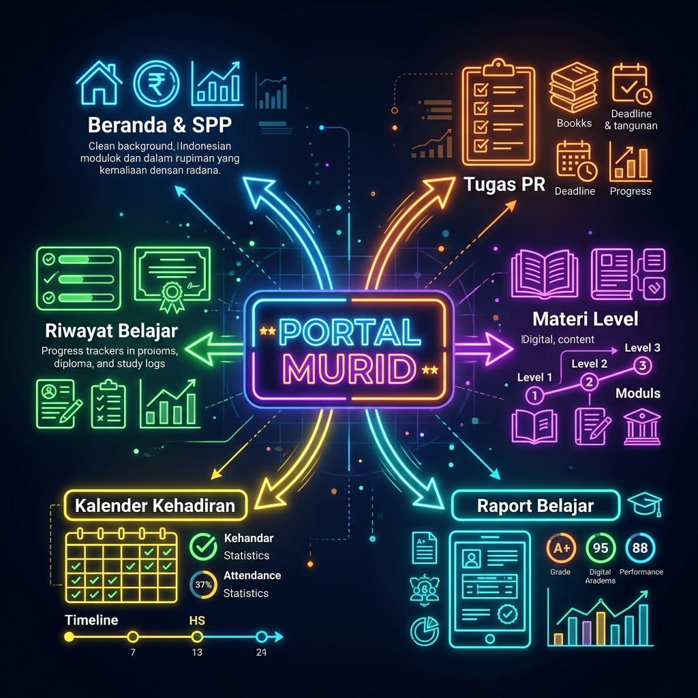

# Dokumentasi Arsitektur & Alur Fitur Portal Murid Rattililqur'an

Dokumen ini menjelaskan secara detail seluruh fitur, arsitektur sistem, dan aliran data (mind mapping) pada portal murid di dalam ekosistem Portal Halaqah Rattililqur'an.

---

## 1. Mind Mapping Alur Fitur Murid
Di bawah ini adalah pemetaan visual alur fungsi, interaksi UI, API Client, dan database untuk murid:

```mermaid
graph TD
  %% Core Node
  Portal[Portal Murid Rattil]
  
  %% Layers
  Portal --> UI[1. Lapisan Antarmuka - UI/UX]
  Portal --> API[2. Lapisan Penghubung - API Client]
  Portal --> GAS[3. Lapisan Bisnis - Google Apps Script]
  Portal --> DB[(4. Lapisan Data - Google Sheets)]

  %% UI Subnodes
  UI --> Beranda[Tab Beranda / Dashboard]
  Beranda --> HeaderInfo[Profil Murid & Status Halaqah]
  Beranda --> TargetBar[Progress Pertemuan: Target 40 Sesi]
  Beranda --> QuickStats[Metrik Utama: % Kehadiran, Total Sesi, Avg Nilai]
  Beranda --> SPPCard[Status SPP: Amanah Lunas / Belum Lunas]
  Beranda --> PRPreview[Preview PR Terdekat]

  UI --> Riwayat[Tab Riwayat KBM]
  Riwayat --> ListRiwayat[Daftar Sesi KBM - Klik untuk Expand]
  ListRiwayat --> DetailRiwayat[Materi, Kehadiran, Adab, Kamera Murid, Koreksi, Catatan, PR]
  Riwayat --> Kalender[Kalender Visual Kehadiran]
  Kalender --> KalWarna[Warna Tanggal: Hijau=Hadir, Ungu=Terlambat, Kuning=Izin, Merah=Alpa]
  Kalender --> PopupDetail[Popup Klik Tanggal: Rincian Sesi & Catatan Guru]

  UI --> PRPage[Tab PR / Latihan Mandiri]
  PRPage --> ListPR[Daftar PR Aktif]
  ListPR --> StatusDeadline[Urgensi: Aman, Mepet, Hari Ini, Lewat Deadline]

  UI --> InfoPage[Tab Info / Kurikulum]
  InfoPage --> GroupedInfo[Grouped by Level]
  GroupedInfo --> MateriDetail[Deskripsi Level, Target, Tips Tajwid, Doa Belajar]

  UI --> RaportPage[Tab Raport]
  RaportPage --> CardRaport[Kartu Raport Published]
  CardRaport --> KomponenRaport[Nilai Akhir, Predikat, Bobot Komponen Nilai]

  UI --> ProfilPage[Tab Pengaturan Profil]
  ProfilPage --> FormEdit[Form Edit: Nama, HP, Email, Alamat, Password]

  %% API Subnodes
  API --> TokenAuth[Otorisasi Sesi Token: Simpan di Local/Session Storage]
  API --> ClientCache[Caching Endpoint: e.g., getSPPStatus cached 120s]
  API --> NetHandler[Penanganan Koneksi: Deteksi Gagal Sinkronisasi]

  %% GAS Subnodes
  GAS --> Router[doGet/doPost Router - Code.gs]
  GAS --> MuridModule[Modul Murid - Code_murid.gs]
  MuridModule --> getDashboard[getDashboardMurid]
  MuridModule --> getRiwayat[getRiwayatMurid]
  MuridModule --> getPR[getLatihanMandiriMurid]
  MuridModule --> getRaport[getRaportMurid]
  MuridModule --> getSPP[getSPPStatus]

  %% DB Subnodes
  DB --> TUsers[Sheet Users: Akun & Sandi]
  DB --> TAnggota[Sheet Anggota: Level & ID Halaqah]
  DB --> THalaqah[Sheet Halaqah: Nama Kelas, Guru, Jadwal & Jam]
  DB --> TKBM[Sheet KBM_ Kelas: Presensi, Adab, Kamera & Catatan]
  DB --> TLog[Sheet KBM_Log: Materi Sesi & Tugas Mandiri]
  DB --> TRaport[Sheet Raport: Nilai Akhir & JSON Detail]

  %% Stylings
  classDef core fill:#ff4757,stroke:#ff6b81,stroke-width:3px,color:#fff,font-weight:bold;
  classDef ui fill:#2980b9,stroke:#3498db,stroke-width:2px,color:#fff,font-weight:bold;
  classDef api fill:#d35400,stroke:#e67e22,stroke-width:2px,color:#fff,font-weight:bold;
  classDef gas fill:#8e44ad,stroke:#9b59b6,stroke-width:2px,color:#fff,font-weight:bold;
  classDef db fill:#27ae60,stroke:#2ecc71,stroke-width:2px,color:#fff,font-weight:bold;
  
  classDef uiSub fill:#eaf2f8,stroke:#a9cce3,stroke-width:1px,color:#1b4f72,font-weight:600;
  classDef apiSub fill:#fdf2e9,stroke:#f5cba7,stroke-width:1px,color:#6e2c00,font-weight:600;
  classDef gasSub fill:#f5eef8,stroke:#d7bde2,stroke-width:1px,color:#4a235a,font-weight:600;
  classDef dbSub fill:#eafaf1,stroke:#abebc6,stroke-width:1px,color:#0e6251,font-weight:600;

  class Portal core;
  class UI ui;
  class API api;
  class GAS gas;
  class DB db;

  class Beranda,HeaderInfo,TargetBar,QuickStats,SPPCard,PRPreview,Riwayat,ListRiwayat,DetailRiwayat,Kalender,KalWarna,PopupDetail,PRPage,ListPR,StatusDeadline,InfoPage,GroupedInfo,MateriDetail,RaportPage,CardRaport,KomponenRaport,ProfilPage,FormEdit uiSub;
  class TokenAuth,ClientCache,NetHandler apiSub;
  class Router,MuridModule,getDashboard,getRiwayat,getPR,getRaport,getSPP gasSub;
  class TUsers,TAnggota,THalaqah,TKBM,TLog,TRaport dbSub;
```

---

## 2. Penjelasan Detail Layer Portal Murid

### Layer 1: Lapisan Antarmuka (UI/UX - PWA)
Lapisan terluar yang berinteraksi langsung dengan murid. Dibangun menggunakan **Vanilla HTML5, CSS3 modern dengan variabel CSS untuk tema gelap/terang, dan Vanilla Javascript**.
* **PWA Capability (`sw.js` & `manifest.json`)**: Memungkinkan aplikasi dipasang (install) di handphone murid seperti aplikasi native, dan melakukan cache static asset untuk loading instan.
* **Responsive Layout**: Antarmuka dioptimalkan penuh untuk tampilan layar ponsel kecil hingga laptop.

### Layer 2: Lapisan Penghubung (API Client - `assets/js/api.js`)
Lapisan perantara antara frontend di browser dengan server Google Apps Script.
* **Token-based Session**: Setelah murid memasukkan NIS & Kata Sandi, sistem menyimpan token login terenkripsi di LocalStorage untuk menjaga sesi tetap aktif.
* **Query Caching**: Mengimplementasikan caching TTL (Time to Live) untuk menghemat kuota pembacaan baris spreadsheet. Contohnya status SPP hanya diperbarui maksimal 2 menit sekali (`120` detik) untuk memotong beban runtime GAS.

### Layer 3: Lapisan Bisnis Backend (Google Apps Script - `.gs`)
Kode Javascript berbasis server yang berjalan di infrastruktur cloud Google.
* **API Router (`Code.gs`)**: Menerima request `GET/POST` dari API Client, memverifikasi tanda pengenal murid (`verifyToken`), lalu meneruskan ke fungsi spesifik di modul murid.
* **Modul Murid (`Code_murid.gs`)**: Berisi logika filter data agar murid hanya dapat melihat data miliknya sendiri. Melakukan penggabungan (join) data secara real-time antara informasi presensi per kelas dengan jurnal kelas di log umum.

### Layer 4: Lapisan Database (Google Sheets)
Spreadsheet Google bertindak sebagai database relasional.
* Relasi murid didasarkan pada `id_murid` (NIS) yang bertindak sebagai primary key untuk menghubungkan profil murid dengan grup halaqah dan daftar nilai KBM.

---

## 3. Rangkuman Poin Fitur Portal Murid

### A. Fitur Dashboard (Beranda)
* **Informasi Kelas & Guru**: Menampilkan nama halaqah murid saat ini, nama guru pengampu, serta tingkat/level tahsin yang sedang diikuti.
* **Progress Bar 40 Pertemuan**: Indikator persentase ketercapaian target 40 pertemuan dalam satu periode/semester.
* **Kehadiran Cepat**: Widget persentase kehadiran aktual dari total sesi yang sudah berjalan.
* **Nilai Rata-rata**: Menampilkan nilai rata-rata kualitas bacaan terakhir (misal: Mumtaz/Jayyid).
* **Kartu Status SPP**: Menampilkan jumlah tagihan SPP yang lunas atau belum lunas dalam 5 bulan ke depan dengan status visual (hijau jika lunas, merah jika belum lunas).
* **Preview PR Aktif**: Ringkasan tugas terdekat yang belum melewati tanggal pengumpulan (deadline).

### B. Fitur Riwayat Belajar & Kehadiran
* **Daftar KBM Expandable**: Daftar riwayat sesi belajar yang dapat diklik untuk membuka detail lengkap:
  1. **Materi**: Pokok materi tahsin yang dipelajari pada sesi tersebut.
  2. **Status Hadir**: Lencana status kehadiran (Hadir, Terlambat, Izin, Sakit, Alpa).
  3. **Adab**: Penilaian adab murid saat belajar (😊 Baik / ⚠️ Butuh Perhatian).
  4. **Kamera Murid**: Lencana visual status menyalanya kamera selama kelas online (`kamera terbuka`, `kamera sering tertutup`, `kamera selalu tertutup`).
  5. **Koreksi Guru**: Catatan koreksi tajwid dan makhraj dari guru (misal: *Ghunnah kurang jelas*).
  6. **Catatan Guru**: Komentar atau motivasi tambahan dari guru untuk murid.
  7. **PR Sesi**: Deskripsi tugas mandiri yang diberikan khusus pada sesi tersebut lengkap dengan tenggat waktu.

### C. Fitur Kalender Kehadiran
* **Penanda Tanggal Berwarna**: Setiap tanggal sesi KBM diwarnai sesuai dengan status kehadiran:
  * 🟢 **Hijau**: Hadir
  * 🟣 **Ungu**: Terlambat
  * 🟡 **Kuning**: Izin/Sakit
  * 🔴 **Merah**: Alpa
* **Popup Detail Kalender**: Mengklik tanggal aktif pada kalender akan memunculkan popup modal yang memuat rincian materi, guru pengajar, adab, status kamera, dan catatan koreksi pada hari tersebut.

### D. Fitur PR & Latihan Mandiri
* **Daftar Tugas Aktif**: Menampilkan seluruh tugas yang pernah diberikan oleh guru.
* **Tingkat Urgensi Sisa Waktu (Deadline Status)**:
  * 🔴 *Lewat*: Tugas sudah melewati deadline.
  * 🟡 *Hari Ini*: Deadline jatuh pada hari ini.
  * 🟠 *Mepet*: Sisa waktu tinggal 1-2 hari lagi.
  * 🟢 *Aman*: Waktu pengumpulan masih lama.
* **Ikon Jenis Latihan**: Menampilkan ikon unik sesuai jenis tugas (misalnya: 🎙️ *VN di WAG*, 🎧 *Mendengar rekaman*, 📝 *Lainnya*).

### E. Fitur Info & Kurikulum Level
* **Kurikulum per Level**: Ringkasan materi apa saja yang dipelajari dari Level 1 hingga Level Qiyam.
* **Target Kelulusan**: Syarat bacaan dan kelancaran untuk naik ke tingkat berikutnya.
* **Tips Tajwid**: Kumpulan kiat-kiat praktis menghafal hukum tajwid dan makhraj khusus level bersangkutan.
* **Doa Belajar**: Doa penyemangat belajar Al-Qur'an.

### F. Fitur Raport Belajar
* **List Raport Semester**: Menampilkan daftar raport yang sudah difinalisasi dan dipublikasikan (`published`) oleh admin.
* **Nilai Akhir & Predikat**: Angka akhir raport beserta predikat otomatisnya (Mumtaz, Jayyid Jiddan, dll).
* **Rincian Bobot Komponen**: Menampilkan tabel nilai rincian tiap komponen penilaian (misal: Kehadiran 20%, Adab 10%, Ujian Akhir 70%) beserta skor yang diperoleh murid.

### G. Fitur Pengaturan Profil
* **Informasi Pribadi**: Form untuk melihat dan memperbarui nomor handphone, alamat e-mail, dan alamat rumah.
* **Ubah Password**: Murid dapat mengganti kata sandi login secara mandiri demi keamanan akun.
